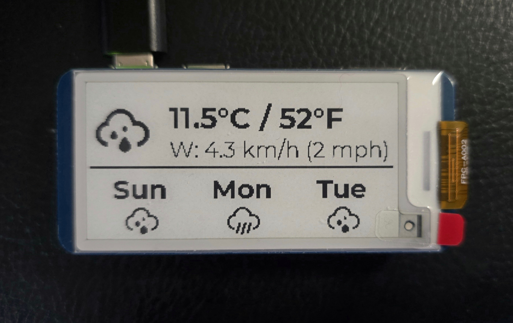

# E-Ink Weather Display

A Python-based weather display application for Waveshare e-ink displays (2.13" V4). Features professional weather icons, modern typography, and automatic updates.



## Features

- 📊 **Current Weather** - Temperature (°C/°F), humidity, and conditions
- 🕒 **3-Hour Forecast** - 5-column forecast intervals showing predicted conditions and temperature
- 🌓 **Astronomy** - Sunrise/Sunset times and current Moon Phase (Icon + Name)
- 💨 **Wind Information** - Wind speed (km/h) and direction arrow
- 🎨 **Professional Design** - Weather-icons font for icons, Montserrat font for text
- 🔄 **Auto-Updates** - Refreshes every 60 minutes
- 🌍 **Multi-Location** - Support for multiple locations (configurable)

## Hardware Requirements

- Raspberry Pi (any model with GPIO) or ESP32
- Waveshare 2.13" e-Paper Display V4
- Internet connection for weather API access

## Software Requirements

- Python 3.7+
- Pillow (PIL)
- requests
- RPi.GPIO (for Raspberry Pi)

## Installation

### 1. Clone the Repository

```bash
git clone <repository-url>
cd weather
```

### 2. Install Dependencies

```bash
pip3 install -r requirements.txt
```

### 3. Download Fonts

The required fonts should be in the `fonts/` directory:
- `weathericons-regular-webfont.ttf` - Weather icons
- `Montserrat-Bold.ttf` - Bold text
- `Montserrat-Regular.ttf` - Regular text

### 4. Configure Location

Edit `src/main.py` to set your location(s):

```python
locations = [
    {"name": "Your City", "lat": YOUR_LATITUDE, "lon": YOUR_LONGITUDE},
]
```

### 5. Test Run

```bash
python3 -m src.main
```

## Running as a System Service

To run the weather display automatically on boot:

### 1. Update Service File

Edit `weather-display.service` to match your setup:
- Change `User=root` to your username if needed
- Update `WorkingDirectory=/root/weather` to your installation path

### 2. Install Service

```bash
# Copy service file
sudo cp weather-display.service /etc/systemd/system/
```

## Project Structure

```
weather/
├── fonts/                          # Font files
├── lib/                            # Waveshare e-ink driver
├── src/                            # Source code
│   ├── main.py                     # Main application
│   ├── weather_service.py          # Weather API client
│   ├── display_service.py          # E-ink display manager
│   ├── icons.py                    # Weather icon renderer
├── requirements.txt                # Python dependencies
├── weather-display.service         # Systemd service file
└── README.md                       # This file
```

## Configuration

### Weather API

This project uses the [Open-Meteo API](https://open-meteo.com/) which is free and doesn't require an API key. It fetches current, hourly (for forecast), and daily (for astronomy) data.

### Display Layout

The display is optimized for a 250x122 landscape resolution (2.13" display) and is divided into three sections:
- **Header**: City name and current date
- **Main Section**: 
    - Left: Current temperature and humidity
    - Center: Large condition icon
    - Right: Astronomy (Sunrise/Sunset) and Moon Phase (Icon + Status)
- **Forecast Section (Bottom Row)**: 
    - Five 3-hour forecast modules (Time, Icon, Temp)
    - Wind speed and direction arrow (Far Right)

### Update Frequency

By default, the display updates every 60 minutes. To change this, edit `src/main.py`:

```python
# Sleep for 60 minutes
time.sleep(60 * 60)  # Change this value
```

## Customization

### Font Sizes

Edit `src/display_service.py` to adjust font sizes:

```python
self.font_temp = ImageFont.truetype(os.path.join(font_dir, "georgiab.ttf"), 36)  # Temperature
self.font_detail = ImageFont.truetype(os.path.join(font_dir, "georgia.ttf"), 18)  # Details
self.font_forecast = ImageFont.truetype(os.path.join(font_dir, "georgiab.ttf"), 22)  # Forecast
```

### Icon Sizes

```python
icon_size = 40  # Current weather icon
small_icon_size = 25  # Forecast icons
```

## Troubleshooting

### Service Won't Start

1. Check logs: `sudo journalctl -u weather-display.service -n 100`
2. Verify working directory exists and contains the code
3. Ensure Python dependencies are installed
4. Check file permissions

### Permission Issues

If you get SPI/GPIO permission errors:

```bash
sudo usermod -a -G spi,gpio $USER
# Log out and back in for changes to take effect
```

### Display Not Updating

1. Check internet connectivity: `ping -c 4 8.8.8.8`
2. Verify API access: Check logs for API errors
3. Ensure e-ink display is properly connected

### Font Not Found Errors

Ensure all font files are in the `fonts/` directory with correct names.

## Weather Icon Mappings

The application uses the weather-icons font with WMO weather codes:

| Condition | Day Icon | Night Icon |
|-----------|----------|------------|
| Clear sky | ☀️ | 🌙 |
| Partly cloudy | ⛅ | ☁️ |
| Overcast | ☁️ | ☁️ |
| Rain | 🌧️ | 🌧️ |
| Snow | ❄️ | ❄️ |
| Thunderstorm | ⛈️ | ⛈️ |
| Fog | 🌫️ | 🌫️ |

## Credits

- **Weather Data**: [Open-Meteo API](https://open-meteo.com/)
- **Weather Icons**: [erikflowers/weather-icons](https://github.com/erikflowers/weather-icons)
- **Font**: Georgia (System Font)
- **E-ink Driver**: [Waveshare](https://www.waveshare.com/)

## License

This project is open source and available under the MIT License.

## Contributing

Contributions are welcome! Please feel free to submit a Pull Request.
